+++
date = '2025-06-18T18:07:50+08:00'
draft = false
title = 'SIMDIS SDK SimCore'
summary= "SIMDIS SDK SimCore代码库功能分析"
+++

## SIMDIS SDK SimCore代码库功能分析

## 一、概述

这套 SDK SimCore 代码系统提供了从低层数学运算、插值求根，到高层地理坐标转换、导航航向处理，再到应用层的随机仿真及单位管理的完整功能链。SIMDIS SDK SimCore 能在无人机仿真、舰载武器模拟、地理信息可视化、科学研究等多领域中，提供一套完整且高效的**底层运算＋坐标处理＋应用服务**解决方案。适用于航空航天、仿真可视化、地图测绘、科学计算等多种场景。

### 代码组成

1. **数学与插值工具**
   - 数学常量和基本运算（Math, Angle）
   - 3D向量和矩阵运算（Vec3, SquareMatrix, Dcm）
   - **Interpolation**：提供最近邻、线性、多点、向量及角度插值，并处理周期跳变与时间驱动插值。
   - **NumericalAnalysis**：实现二分法（Bisection）、割线法（Secant）、二阶 Newton 插值及反向插值算法。
   - **SquareMatrix**：方阵的构造、单位化、置零、转置、缩放、加法及矩阵乘法，支持元素访问和近似比较。
2. **坐标系统**
   - 坐标定义和转换（Coordinate, CoordinateConverter）
   - 特殊坐标系统（GARS）
   - **MultiFrameCoordinate**：在 LLA（经纬高）与 ECEF（地心地固）等多坐标系间双向转换，支持缓存与懒更新。
   - **Mgrs**：MGRS ↔ UTM/UPS ↔ 地理坐标的全流程双向转换，含特殊区域（Svalbard/Norway）兼容。
   - **MagneticVariance**：基于 NOAA 世界磁场模型（WMM）计算地磁偏角，并提供真/磁航向互转。
   - **VerticalDatum**：枚举不同垂直基准（WGS-84、MSL、用户自定义）。
3. **随机数与数值环境**
   - **Random**：生成均匀、正态（实/复）、指数、Poisson、几何、二项及离散均匀分布样本，支持全局与手动种子。
   - **Units**：定义各种物理量单位及其相互转换，提供注册表和查询接口。
   - **UnitContext**：管理当前应用的单位和显示格式（时间、坐标、角度、距离、速度、磁偏、高程等），可动态修改精度与格式。
4. **几何计算**
   - 基础几何体和相交测试（Geometry）
   - 地理围栏（GeoFence）
5. **应用层**
   - 距离、角度、高度等计算（Calculations）
   - 磁偏角和垂直基准面转换（DatumConvert）
   - 多边形转换为地理围栏（GogToGeoFence）


### 使用场景

1. **航空航天／无人机仿真**

   * 路径规划、姿态平滑、真磁航向转换、传感器噪声注入与多坐标系数据融合。
2. **地理信息系统（GIS）与测绘**

   * MGRS/UTM/UPS 与地理坐标互转、地理围栏判定、GOG 图形转围栏等大规模地图服务。
3. **军事与舰船导航**

   * 高精度地磁偏角计算、各种坐标系（NED/ENU/ECEF/ECI）转换、Sodano 测地线计算。
4. **科学计算与可视化**

   * 数值根查找（Bisection、Secant、Newton 插值）、方阵与 DCM 操作、随机分布采样、物理量单位管理与格式化。


### 编译器要求

从代码中可以看出：

1. **C++11或更高**：使用了 `noexcept`、`= default` 等C++11特性
2. **MSVC版本检测**：代码检查 `_MSC_VER < 1800` 来处理旧版MSVC的兼容性

### 外部依赖

这是一个相对独立的数学计算模块，外部依赖很少，主要依赖标准库。这种设计使得代码具有良好的可移植性和独立性。这些代码**不依赖**：

- 第三方数学库（如Eigen、BLAS等）
- 图形库（如OpenGL、DirectX）
- 其他第三方框架


## 二、代码文件功能分析

### 1. MathConstants.h
**功能**：定义常用数学常量
- 主要常量：M_PI, M_E, M_TWOPI, M_PI_2等
- 跨平台兼容性处理（Windows/Linux）

### 2. Vec3.h
**功能**：三维向量类
- **数据结构**：包含3个double元素的向量
- **主要操作**：
  - 构造函数和赋值操作
  - 向量运算：加减、标量乘除、点积、叉积
  - 访问器：x/y/z, lat/lon/alt, range/azimuth/elevation等
  - 工具函数：length(), normalize(), zero()

### 3. Angle.h/cpp
**功能**：角度处理和转换
- **角度规范化**：
  - `angFix2PI()`: 调整到[0, 2π)
  - `angFixPI()`: 调整到[-π, π]
  - `angFixPI2()`: 钳制到[-π/2, π/2]
  - 度数版本：`angFix360()`, `angFix180()`, `angFix90()`
- **角度比较**：
  - `areAnglesEqual()`: 考虑周期性的角度相等判断
  - `angleDifference()`: 计算两角度间最短差值
- **角度计算**：
  - `isAngleBetween()`: 判断角度是否在扇形范围内
  - `rotateEulerAngle()`: 欧拉角旋转
- **特殊函数**：
  - `inverseCosine()`, `inverseSine()`: 带误差容忍的反三角函数

**Angle模块**

| 函数            | 输入                   | 输出              | 说明                 |
| --------------- | ---------------------- | ----------------- | -------------------- |
| angFix2PI       | 角度(弧度)             | [0, 2π)范围的角度 | 角度规范化           |
| angFixPI        | 角度(弧度)             | [-π, π]范围的角度 | 角度规范化           |
| areAnglesEqual  | 两个角度+容差          | bool              | 考虑周期性的相等判断 |
| angleDifference | from角度, to角度       | (-π, π]范围的差值 | 最短路径角度差       |
| isAngleBetween  | 测试角, 起始角, 扫描角 | bool              | 扇形范围判断         |

### 4. Math.h/cpp
**功能**：通用数学和矩阵运算
- **基础数学函数**：
  - `sdkMin/Max()`, `clamp()`, `square()`, `sign()`
  - `areEqual()`: 浮点数相等比较
  - `toScientific()`: 科学计数法转换
- **向量操作**：
  - `v3Distance()`, `v3Unit()`, `v3Angle()`
  - `v3RotX/Y()`: 绕坐标轴旋转
  - `v3SphtoRec()`: 球坐标到直角坐标转换
- **矩阵运算**：
  - `d3MMmult()`: 3×3矩阵乘法
  - `d3Mv3Mult()`: 矩阵向量乘法
  - `d3MMTmult()`: 矩阵与转置矩阵相乘
- **坐标系转换**：
  - `d3DCMtoEuler()`: 方向余弦矩阵转欧拉角
  - `d3EulertoDCM()`: 欧拉角转方向余弦矩阵
  - `d3EulertoQ()`: 欧拉角转四元数
  - `d3QtoEuler()`: 四元数转欧拉角
- **四元数运算**：
  - `dQNorm()`: 四元数归一化
  - `dQMult()`: 四元数乘法

### 5. CoordinateSystem.h/cpp

**功能**：定义坐标系统枚举和相关常量

- **坐标系统枚举**：
  - `COORD_SYS_NED`: 北东下坐标系
  - `COORD_SYS_NWU`: 北西上坐标系
  - `COORD_SYS_ENU`: 东北上坐标系
  - `COORD_SYS_LLA`: 经纬度高度坐标系
  - `COORD_SYS_ECEF`: 地心地固坐标系
  - `COORD_SYS_ECI`: 地心惯性坐标系
  - `COORD_SYS_XEAST`: X轴向东的切平面
  - `COORD_SYS_GTP`: 通用切平面
- **地球模型**：
  - `WGS_84`: WGS-84椭球模型
  - `FLAT_EARTH`: 平面地球模型
  - `TANGENT_PLANE_WGS_84`: WGS-84切平面
  - `PERFECT_SPHERE`: 完美球体模型
- **常量定义**：WGS-84参数、地球旋转速率等

### 6. Coordinate.h

**功能**：坐标数据容器类

- **成员数据**：
  - 位置(position): Vec3
  - 方向(orientation): Vec3
  - 速度(velocity): Vec3
  - 加速度(acceleration): Vec3
  - 坐标系类型
  - ECI时间
- **主要接口**：
  - 设置/获取各种状态量
  - 坐标系统管理
  - 数据有效性标志

### 7. CoordinateConverter.h/cpp

**功能**：坐标系转换核心类

- **主要功能**：

  - 各种坐标系之间的转换
  - 参考原点管理
  - 切平面偏移和旋转

- **支持的转换**：

  - LLA ↔ ECEF ↔ ECI
  - LLA ↔ NED/NWU/ENU
  - ECEF ↔ NED/NWU/ENU
  - XEAST ↔ 其他坐标系

- **关键方法**：

  ```cpp
  convert(const Coordinate& in, Coordinate& out, CoordinateSystem sys)
  setReferenceOrigin(lat, lon, alt)
  convertGeodeticToEcef()
  convertEcefToGeodetic()
  ```

**CoordinateConverter模块**

| 函数                  | 输入                    | 输出       | 说明               |
| --------------------- | ----------------------- | ---------- | ------------------ |
| convert               | Coordinate + 目标坐标系 | Coordinate | 通用坐标转换       |
| setReferenceOrigin    | 纬度、经度、高度        | 无         | 设置参考原点       |
| convertGeodeticToEcef | LLA坐标                 | ECEF坐标   | 大地坐标转地心地固 |
| convertEcefToGeodetic | ECEF坐标                | LLA坐标    | 地心地固转大地坐标 |

### 8. Calculations.h/cpp

**功能**：高级计算功能

- **距离计算**：
  - `calculateSlant()`: 斜距
  - `calculateGroundDist()`: 地面距离
  - `calculateAltitude()`: 高度差
- **角度计算**：
  - `calculateRelAzEl()`: 相对方位角/俯仰角
  - `calculateAbsAzEl()`: 绝对方位角/俯仰角
  - `calculateAspectAngle()`: 纵横角
- **速度计算**：
  - `calculateClosingVelocity()`: 接近速度
  - `calculateVelocityDelta()`: 速度差
  - `calculateRangeRate()`: 距离变化率
- **特殊计算**：
  - `calculateGeodesicDRCR()`: 测地线下行程/横程
  - `calculateHorizonDist()`: 地平线距离
  - `sodanoDirect/Inverse()`: Sodano算法
- **实用功能**：
  - `positionInGate()`: 判断位置是否在门内
  - `laserInGate()`: 判断激光是否在门内

**Calculations模块**

| 函数                  | 输入                     | 输出           | 说明           |
| --------------------- | ------------------------ | -------------- | -------------- |
| calculateSlant        | 两个LLA位置 + 地球模型   | 距离(m)        | 计算斜距       |
| calculateRelAzEl      | from/to位置 + 方向       | 方位角、俯仰角 | 相对角度       |
| calculateGeodesicDRCR | from位置 + 方向 + to位置 | 下行程、横程   | 测地线计算     |
| sodanoInverse         | 两个LLA位置              | 距离 + 方位角  | 反向Sodano算法 |
| calculateHorizonDist  | LLA位置 + 地平线类型     | 距离(m)        | 地平线距离     |

### 9. Geometry.h/cpp

**功能**：几何计算和相交测试

- 基本几何体：

  - `Plane`: 3D平面（ax + by + cz + d = 0）
  - `Polytope`: 凸多面体（多个平面的集合）
  - `Triangle`: 三角形
  - `Ray`: 射线（原点+方向）
  - `Sphere`: 球体
  - `Ellipsoid`: 椭球体
  - `QuadricSurface`: 二次曲面
  
- 相交测试：

  - `rayIntersectsTriangle()`: 射线-三角形相交
  - `rayIntersectsPlane()`: 射线-平面相交
  - `rayIntersectsSphere()`: 射线-球体相交
  - `rayIntersectsEllipsoid()`: 射线-椭球体相交
  - `rayIntersectsQuadricSurface()`: 射线-二次曲面相交
  
- 其他功能：

  - `reflectVector()`: 向量反射
  - `reflectRay()`: 射线反射
  - `ellipsoidNormalAtIntersection()`: 椭球体表面法线

**Geometry模块**

| 函数                  | 输入           | 输出               | 说明               |
| --------------------- | -------------- | ------------------ | ------------------ |
| rayIntersectsTriangle | Ray + Triangle | IntersectResultsRT | 射线三角形相交测试 |
| rayIntersectsPlane    | Ray + Plane    | optional<double>   | 返回相交距离t      |
| rayIntersectsSphere   | Ray + Sphere   | optional<double>   | 返回最近相交距离   |
| reflectVector         | 向量 + 法线    | Vec3               | 反射向量           |

### 10. GeoFence.h/cpp

**功能**：地理围栏（地理区域边界）

- 主要功能：

  - 支持任意多边形区域定义
  - 使用射线投射算法判断点是否在围栏内
  - 支持3D空间的围栏（考虑高度）
  
- 实现原理：

  - 将地表多边形扩展为3D"咖啡滤纸"形状
  - 使用偶数/奇数规则进行内外判断
  - 支持ECEF和LLA坐标系输入

**GeoFence模块**

| 函数      | 输入          | 输出             | 说明                 |
| --------- | ------------- | ---------------- | -------------------- |
| set       | 点集 + 坐标系 | 无               | 设置围栏边界         |
| contains  | 坐标/ECEF点   | bool             | 判断点是否在围栏内   |
| triangles | 无            | vector<Triangle> | 获取构成围栏的三角形 |

### 11. Gars.h/cpp

**功能**：全球区域参考系统（GARS）坐标转换

- GARS坐标格式：

  - 5-7个字符：经度带(3位) + 纬度带(2字母) + 可选的15分钟象限 + 可选的5分钟键
  - 例如："180AA"、"180AA1"、"180AA19"
  
- 主要功能：

  - `isValidGars()`: 验证GARS坐标字符串
  - `convertGarsToGeodetic()`: GARS转经纬度
  - `convertGeodeticToGars()`: 经纬度转GARS
  
- 精度级别：

  - GARS_30: 30分钟级别（5字符）
  - GARS_15: 15分钟级别（6字符）
  - GARS_5: 5分钟级别（7字符）

**Gars模块**

| 函数                  | 输入             | 输出            | 说明           |
| --------------------- | ---------------- | --------------- | -------------- |
| isValidGars           | GARS字符串       | bool + 分解值   | 验证并解析GARS |
| convertGarsToGeodetic | GARS字符串       | 纬度/经度(弧度) | GARS转经纬度   |
| convertGeodeticToGars | 纬度/经度 + 精度 | GARS字符串      | 经纬度转GARS   |

### 12. Dcm.h/cpp

**功能**：方向余弦矩阵（DCM）操作

- **继承关系**：继承自`SquareMatrix`（3×3方阵）

- 主要功能：

  - `determinant()`: 计算行列式（应为1）
  - `isValid()`: 验证是否为有效旋转矩阵
  - `toEuler()`: DCM转欧拉角
  - `fromEuler()`: 欧拉角转DCM
  - `toQ()`: DCM转四元数
  - `fromQ()`: 四元数转DCM

**Dcm模块**

| 函数      | 输入       | 输出            | 说明        |
| --------- | ---------- | --------------- | ----------- |
| fromEuler | Vec3欧拉角 | 无(修改自身)    | 欧拉角转DCM |
| toEuler   | 无         | Vec3欧拉角      | DCM转欧拉角 |
| fromQ     | 四元数[4]  | int(错误码)     | 四元数转DCM |
| toQ       | 无         | array<double,4> | DCM转四元数 |

### 13. DatumConvert.h/cpp

**功能**：基准面转换（磁偏角和垂直基准）

- 磁偏角转换：

  - 支持TRUE（真北）、WMM（世界磁场模型）、USER（用户定义）之间转换
  - 使用WorldMagneticModel进行磁偏角计算
  
- 垂直基准转换：

  - 支持WGS84和USER之间转换
- 不支持MSL（平均海平面）转换

### 14. GogToGeoFence.h/cpp

**功能**：将GOG（Geo-Object Graphics）转换为地理围栏

- 支持的GOG类型：

  - LINE（闭合线）
  - POLYGON（多边形）
  
- 限制条件：

  - 只支持绝对坐标
  - LINE必须闭合（首尾点相同）
  - 不支持凹多边形

### 15. Interpolation.h/cpp

**功能**：提供多种插值算法，用于在标量、向量和角度数据间平滑过渡。该模块支持：

- **最近邻插值**：快速获取相邻数据点的值，适用于不需要平滑过渡的简单场景。
- **线性插值**：对标量和泛型类型实现一维和三点映射插值，可应用于数值分析与参数调节。
- **Map 容器插值**：在键值映射中寻找上下界并进行插值，常用于时序数据或离散样本间的数据估算。
- **三维向量插值**：对 `Vec3` 对象的三个分量分别插值，适用于实体位置动画与轨迹平滑。
- **角度插值**：处理周期跳变（跨 0/2π）情形，并支持基于时间戳的动态插值，适用于航姿和方向数据平滑。

| 函数                                   | 输入                                           | 输出            | 说明                                                      |
| -------------------------------------- | ---------------------------------------------- | --------------- | --------------------------------------------------------- |
| getFactor                              | lowVal, highVal, exactVal (double)             | factor (double) | 计算 exactVal 在 [lowVal, highVal] 范围内的比例因子 (0–1) |
| nearestNeighborInterpolate             | a, b (Type), factor (double)                   | result (Type)   | 最近邻插值，factor<0.5 返回 a，否则返回 b                 |
| linearInterpolate(a,b,xFactor)         | a, b (Type), xFactor (double)                  | result (Type)   | 两点线性插值                                              |
| linearInterpolate(a,b,x1,xVal,x2)      | a, b (Type), x1, xVal, x2 (double)             | result (Type)   | 三点映射插值                                              |
| linearInterpolate(map, value, clamp)   | mp(std::map<T1,T2>&), value (T1), clamp (bool) | result (T2)     | Map 容器插值，边界可钳制                                  |
| linearInterpolate(prev,next,mixFactor) | prev, next (Vec3), mixFactor (double)          | result (Vec3)   | 三维向量各分量线性插值                                    |
| linearInterpolateAngle(a,b,factor)     | a, b (double), factor (double)                 | angle (double)  | 角度插值，处理 0/2π 周期跳变                              |
| linearInterpolateAngle(a,b,ta,t,tb)    | a, b (double), ta, t, tb (double)              | angle (double)  | 时间驱动的角度插值                                        |

### 16. MagneticVariance.h/cpp

**功能**：基于 NOAA 世界磁场模型（WMM）计算地磁偏角，并提供真航向与磁航向之间的双向转换接口。该模块特点包括：

- **时序敏感**：支持按日序和日期时间戳计算，满足不同时间粒度的导航需求。
- **转换精度**：结合高精度模型，确保航空与海洋导航中的航向转换误差最小。
- **错误处理**：通过返回码和日志通知机制反馈计算异常或输入错误。

| 函数                                      | 输入                                     | 输出                  | 说明                     |
| ----------------------------------------- | ---------------------------------------- | --------------------- | ------------------------ |
| calculateMagneticVariance(lla, day, year) | lla (Vec3), ordinalDay (int), year (int) | varianceRad (double&) | 根据日序和年份计算磁偏角 |
| calculateMagneticVariance(lla, ts)        | lla (Vec3), timeStamp (TimeStamp)        | varianceRad (double&) | 使用时间戳计算磁偏角     |
| calculateMagneticBearing(lla, ts)         | lla (Vec3), timeStamp (TimeStamp)        | bearingRad (double&)  | 真航向转换为磁航向       |
| calculateTrueBearing(lla, ts)             | lla (Vec3), timeStamp (TimeStamp)        | bearingRad (double&)  | 磁航向转换为真航向       |

### 17. Mgrs.h/cpp

**功能**：实现 MGRS（陆地网格参考系统）、UTM、UPS 与大地坐标之间的高效双向转换。模块特性：

- **全流程覆盖**：从字符串解析到投影转换，涵盖 MGRS→UTM/UPS→地理坐标及反向流程。
- **特殊区处理**：针对 Svalbard 和 Norway 区域的特殊规则，提供兼容性处理。
- **输入校验**：细化错误信息输出，帮助调用方定位格式或数值异常。

| 函数                  | 输入                                      | 输出                                                         | 说明                                     |
| --------------------- | ----------------------------------------- | ------------------------------------------------------------ | ---------------------------------------- |
| convertMgrsToGeodetic | mgrs (std::string)                        | lat, lon (double&)                                           | 解析 MGRS 字符串并输出纬度/经度（弧度）  |
| breakMgrsString       | mgrs (std::string)                        | zone (int), gzdLetters (std::string), easting, northing (double) | 拆分 MGRS 为区域号、网格设计子与偏移量   |
| convertMgrsToUtm      | zone, gzdLetters, easting, northing       | utmZone (int), easting, northing (double)                    | MGRS 转 UTM，含 Svalbard/Norway 特例处理 |
| convertUtmToGeodetic  | utmZone (int), easting, northing (double) | lat, lon (double&)                                           | UTM 投影坐标转换为纬度/经度              |
| convertMgrsToUps      | mgrs (std::string)                        | easting, northing (double), northPole (bool)                 | MGRS 转极地 UPS 投影                     |

### 18. MultiFrameCoordinate.h/cpp

**功能**：缓存并在多坐标系（LLA 与 ECEF）间转换坐标，支持懒更新与错误处理。模块特点：

* **双向缓存**：设置 LLA 或 ECEF 后，可按需转换并缓存结果，避免重复计算。
* **系统兼容**：支持 LLA、ECEF 及通过 CoordinateConverter 进行 ECI、局部机体系或其他系统转换。
* **错误反馈**：对无效系统或未初始化转换器输入提供返回码。

| 函数                      | 输入                                                         | 输出                                    | 说明                                    |
| ------------------------- | ------------------------------------------------------------ | --------------------------------------- | --------------------------------------- |
| setCoordinate(coord)      | coordinate (simCore::Coordinate)                             | return code (int)                       | 设置 LLA 或 ECEF 坐标，其他系统返回错误 |
| setCoordinate(coord,conv) | coordinate (simCore::Coordinate), converter (simCore::CoordinateConverter) | return code (int)                       | 使用转换器设置并转换到 LLA/ECEF         |
| clear()                   | —                                                            | —                                       | 清除缓存坐标，置为无效                  |
| isValid()                 | —                                                            | bool                                    | 返回当前是否有有效坐标                  |
| llaCoordinate()           | —                                                            | coordinate (const simCore::Coordinate&) | 获取 LLA 坐标，必要时从 ECEF 懒转换     |
| ecefCoordinate()          | —                                                            | coordinate (const simCore::Coordinate&) | 获取 ECEF 坐标，必要时从 LLA 懒转换     |

### 19. NumericalAnalysis.h/cpp

**功能**：数值根查找与插值算法集合，提供二分法、割线法及 Newton 插值/反向插值，适用于求根与时间映射。模块特点：

* **多方法支持**：同时提供 Bisection 和 Secant 迭代算法。
* **高阶插值**：实现二阶 Newton 插值与反向线性插值。
* **收敛控制**：迭代次数与误差容限可配置，返回状态码指示结果。

| 函数                     | 输入                                                         | 输出                        | 说明                    |
| ------------------------ | ------------------------------------------------------------ | --------------------------- | ----------------------- |
| BisectionSearch::searchX | x (double&), y (double), xlo (double&), xhi (double&), type (NumericalSearchType) | state (NumericalSearchType) | 二分法迭代求根          |
| BisectionSearch::count   | —                                                            | count (int)                 | 获取二分法迭代次数      |
| LinearSearch::searchX    | x (double&), y (double), xlo (double), xhi (double), fdx (double), type (NumericalSearchType) | state (NumericalSearchType) | 割线法迭代求根          |
| LinearSearch::count      | —                                                            | count (int)                 | 获取割线法迭代次数      |
| newtonInterp             | t0 (double), t\[3] (const double\[]), f\[3] (const double\[]), funcAtT0 (double&) | return code (int)           | 二阶 Newton 插值求值    |
| invLinearInterp          | funcAtT0 (double), t\[3] (double\[]), f\[3] (double\[]), tol (double), t0 (double&) | return code (int)           | 反向线性/高阶插值求时间 |

### 20. Random.h/cpp

**功能**：多种伪随机分布生成，包括均匀、正态、复正态、指数、Poisson、几何、二项和离散均匀，及全局种子初始化。模块特点：

* **统一接口**：所有分布通过 operator() 返回随机样本。
* **算法多样**：支持 Box-Muller、极坐标、插值法等多种基础生成方法。
* **可复现性**：可设置种子确保结果可重复。

| 函数                                | 输入            | 输出             | 说明                         |
| ----------------------------------- | --------------- | ---------------- | ---------------------------- |
| initializeRandomSeedWithTime        | —               | —                | 用系统时钟初始化全局随机种子 |
| basicUniformVariable                | seed (double\*) | value (double)   | 生成 \[0,1] 区间均匀值       |
| NormalVariable::operator()          | —               | sample (double)  | 生成正态分布随机数           |
| GaussianVariable::operator()        | —               | sample (Complex) | 生成复正态分布随机数         |
| UniformVariable::operator()         | —               | sample (double)  | 生成均匀分布随机数           |
| ExponentialVariable::operator()     | —               | sample (double)  | 生成指数分布随机数           |
| PoissonVariable::operator()         | —               | sample (int)     | 生成 Poisson 分布随机数      |
| GeometricVariable::operator()       | —               | sample (int)     | 生成几何分布随机数           |
| BinomialVariable::operator()        | —               | sample (int)     | 生成二项分布随机数           |
| DiscreteUniformVariable::operator() | —               | sample (int)     | 生成离散均匀分布随机数       |

### 21. SquareMatrix.h/cpp

**功能**：提供方阵操作，包括构造、身份矩阵、置零、转置、缩放、加法和左右乘法，支持行列访问与比较。

| 函数                    | 输入                                  | 输出                | 说明                                    |
| ----------------------- | ------------------------------------- | ------------------- | --------------------------------------- |
| SquareMatrix(dimension) | dimension(unsigned int)               | —                   | 构造指定维度的零矩阵                    |
| SquareMatrix()          | —                                     | —                   | 构造 3×3 全零矩阵                       |
| SquareMatrix(rhs)       | rhs(const SquareMatrix&)              | —                   | 复制构造                                |
| makeIdentity()          | —                                     | return code (int)   | 将矩阵置为单位矩阵                      |
| makeZero()              | —                                     | return code (int)   | 将矩阵置零                              |
| transpose()             | —                                     | return code (int)   | 矩阵转置                                |
| set(row,col,value)      | row, col(unsigned int), value(double) | return code (int)   | 设置指定元素                            |
| get(row,col)            | row, col(unsigned int)                | value (double)      | 获取指定元素，越界返回 NaN              |
| row(index)              | index(unsigned int)                   | std::vector<double> | 获取指定行                              |
| column(index)           | index(unsigned int)                   | std::vector<double> | 获取指定列                              |
| data()                  | —                                     | const double\*      | 获取内部数据指针，维度<2 时返回 nullptr |
| scale(factor)           | factor(double)                        | return code (int)   | 矩阵数值缩放                            |
| add(m)                  | m(const SquareMatrix&)                | return code (int)   | 矩阵元素逐一相加                        |
| postMultiply(m)         | m(const SquareMatrix&)                | return code (int)   | this = this \* m                        |
| preMultiply(m)          | m(const SquareMatrix&)                | return code (int)   | this = m \* this                        |
| areEqual(m1,m2,t)       | m1,m2(const SquareMatrix&), t(double) | bool                | 矩阵按容差 t 比较是否相等               |

### 22. UnitContext.h/cpp

**功能**：维护并格式化各种单位与格式设置，包括时间、坐标、角度、距离、速度及地理/磁偏/垂直基准。

| 函数                          | 输入                       | 输出             | 说明             |
| ----------------------------- | -------------------------- | ---------------- | ---------------- |
| timeFormat()                  | —                          | TimeFormat       | 获取时间格式     |
| setTimeFormat(unit)           | unit(TimeFormat)           | —                | 设置时间格式     |
| timePrecision()               | —                          | unsigned int     | 获取时间精度     |
| setTimePrecision(prec)        | prec(unsigned int)         | —                | 设置时间精度     |
| geodeticFormat()              | —                          | GeodeticFormat   | 获取地理坐标格式 |
| setGeodeticFormat(format)     | format(GeodeticFormat)     | —                | 设置地理坐标格式 |
| geodeticPrecision()           | —                          | unsigned int     | 获取地理坐标精度 |
| setGeodeticPrecision(prec)    | prec(unsigned int)         | —                | 设置地理坐标精度 |
| distanceUnits()               | —                          | const Units&     | 获取距离单位     |
| setDistanceUnits(unit)        | unit(const Units&)         | —                | 设置距离单位     |
| distancePrecision()           | —                          | unsigned int     | 获取距离精度     |
| setDistancePrecision(prec)    | prec(unsigned int)         | —                | 设置距离精度     |
| altitudeUnits()               | —                          | const Units&     | 获取高度单位     |
| setAltitudeUnits(unit)        | unit(const Units&)         | —                | 设置高度单位     |
| altitudePrecision()           | —                          | unsigned int     | 获取高度精度     |
| setAltitudePrecision(prec)    | prec(unsigned int)         | —                | 设置高度精度     |
| angleUnits()                  | —                          | const Units&     | 获取角度单位     |
| setAngleUnits(unit)           | unit(const Units&)         | —                | 设置角度单位     |
| anglePrecision()              | —                          | unsigned int     | 获取角度精度     |
| setAnglePrecision(prec)       | prec(unsigned int)         | —                | 设置角度精度     |
| speedUnits()                  | —                          | const Units&     | 获取速度单位     |
| setSpeedUnits(unit)           | unit(const Units&)         | —                | 设置速度单位     |
| speedPrecision()              | —                          | unsigned int     | 获取速度精度     |
| setSpeedPrecision(prec)       | prec(unsigned int)         | —                | 设置速度精度     |
| genericPrecision()            | —                          | unsigned int     | 获取通用精度     |
| setGenericPrecision(prec)     | prec(unsigned int)         | —                | 设置通用精度     |
| coordinateSystem()            | —                          | CoordinateSystem | 获取坐标系类型   |
| setCoordinateSystem(coordSys) | coordSys(CoordinateSystem) | —                | 设置坐标系类型   |
| magneticVariance()            | —                          | MagneticVariance | 获取磁偏角模式   |
| setMagneticVariance(mv)       | mv(MagneticVariance)       | —                | 设置磁偏角模式   |
| verticalDatum()               | —                          | VerticalDatum    | 获取垂直基准     |
| setVerticalDatum(vd)          | vd(VerticalDatum)          | —                | 设置垂直基准     |
| referenceYear()               | —                          | int              | 获取参考年份     |
| setReferenceYear(refYear)     | refYear(int)               | —                | 设置参考年份     |
| datumConvert()                | —                          | DatumConvertPtr  | 获取基准转换器   |
| setDatumConvert(convert)      | convert(DatumConvertPtr)   | —                | 设置基准转换器   |

### 23. Units.h/cpp

**功能**：定义并管理各类单位及其转换，包括时间、角度、长度、速度、加速度、温度、频率、体积、压力和电位等，同时提供注册与查询功能。

| 函数                                            | 输入                                                   | 输出         | 说明                         |
| ----------------------------------------------- | ------------------------------------------------------ | ------------ | ---------------------------- |
| Units()                                         | –                                                      | –            | 构造无效单位                 |
| Units(name, abbrev, toBase, family)             | name: stringabbrev: stringtoBase: doublefamily: string | –            | 构造带偏移与转换因子的单位   |
| offsetThenScaleUnit(...)                        | name, abbrevoffset: doubletoBase: doublefamily: string | Units        | 构造偏移缩放单位             |
| name()                                          | –                                                      | string&      | 获取单位名称                 |
| abbreviation()                                  | –                                                      | string&      | 获取单位缩写                 |
| family()                                        | –                                                      | string&      | 获取单位族                   |
| isValid()                                       | –                                                      | bool         | 判断单位是否有效             |
| canConvert(toUnits)                             | toUnits: Units                                         | bool         | 判断是否可转换               |
| convertTo(toUnits, value, output)               | toUnits: Unitsvalue: doubleoutput: double&             | int          | 转换并输出结果，失败返回非0  |
| convertTo(toUnits, value)                       | toUnits: Unitsvalue: double                            | double       | 转换并返回结果，错误返回原值 |
| toBaseScalar()                                  | –                                                      | double       | 获取缩放因子                 |
| toBaseOffset()                                  | –                                                      | double       | 获取基准偏移                 |
| operator==(other)                               | other: Units                                           | bool         | 单位等价比较                 |
| operator!=(other)                               | other: Units                                           | bool         | 单位不等比较                 |
| UnitsRegistry::registerDefaultUnits()           | –                                                      | –            | 注册所有内置单位             |
| UnitsRegistry::registerUnits(units)             | units: Units                                           | int          | 添加新单位                   |
| UnitsRegistry::units(family)                    | family: string                                         | UnitsVector& | 获取指定族单位列表           |
| UnitsRegistry::families()                       | –                                                      | vector       | 获取所有单位族名称           |
| UnitsRegistry::unitsByName(name)                | name: string                                           | Units&       | 按名称查询单位               |
| UnitsRegistry::unitsByName(name, out)           | name: stringout: Units&                                | int          | 按名称查询并输出，失败返回0  |
| UnitsRegistry::unitsByAbbreviation(abbrev)      | abbrev: string                                         | Units&       | 按缩写查询单位               |
| UnitsRegistry::unitsByAbbreviation(abbrev, out) | abbrev: stringout: Units&                              | int          | 按缩写查询并输出，失败返回0  |


### 24. VerticalDatum.h

**功能**：定义垂直基准枚举，用于指定地理高度参考面。

| 枚举值           | 说明                         |
| ---------------- | ---------------------------- |
| VERTDATUM\_WGS84 | WGS-84 椭球体垂直基准        |
| VERTDATUM\_MSL   | 基于 EGM-96 的平均海平面基准 |
| VERTDATUM\_USER  | 用户自定义垂直基准偏移       |

---

## 三、模块依赖关系图

下图展示了该代码库之间的依赖关系：

```mermaid
graph TD
    MathConstants.h --> Vec3.h
    Vec3.h --> Geometry.h
    Vec3.h --> GeoFence.h
    Vec3.h --> Coordinate.h
    Vec3.h --> MagneticVariance.h
    
    CoordinateSystem.h --> Coordinate.h
    CoordinateSystem.h --> CoordinateConverter.h
    CoordinateSystem.h --> DatumConvert.h
    CoordinateSystem.h --> GeoFence.h
    CoordinateSystem.h --> Mgrs.h
    
    Coordinate.h --> CoordinateConverter.h
    CoordinateConverter.h --> Calculations.h
    
    Angle.h --> Gars.h
    Angle.h --> Dcm.h
    Angle.h --> Interpolation.h
    Angle.h --> MagneticVariance.h
    Angle.h --> Mgrs.h
    
    Math.h --> Dcm.h
    Math.h --> Geometry.h
    Math.h --> Interpolation.h
    Math.h --> Mgrs.h
    
    Geometry.h --> Geometry.cpp
    Geometry.h --> GeoFence.h
    
    GeoFence.h --> GeoFence.cpp
    GeoFence.h --> GogToGeoFence.h
    
    Gars.h --> Gars.cpp
    Dcm.h --> Dcm.cpp
    DatumConvert.h --> DatumConvert.cpp
    GogToGeoFence.h --> GogToGeoFence.cpp
    
    SquareMatrix.h --> Dcm.h
    MagneticVariance.h --> DatumConvert.h
    VerticalDatum.h --> DatumConvert.h
    WorldMagneticModel.h --> DatumConvert.h
    GOG/Parser.h --> GogToGeoFence.h
    
    %% 旧有模块依赖
    Interpolation.h --> Interpolation.cpp
    MagneticVariance.h --> MagneticVariance.cpp
    Mgrs.h --> Mgrs.cpp
    MultiFrameCoordinate.h --> MultiFrameCoordinate.cpp
    NumericalAnalysis.h --> NumericalAnalysis.cpp
    Random.h --> Random.cpp
    
    %% Interpolation依赖
    Common/Export.h --> Interpolation.h
    
    %% MagneticVariance依赖
    Time/TimeClass.h --> MagneticVariance.h
    simNotify/Notify.h --> MagneticVariance.h
    Common/Common.h --> MagneticVariance.h
    
    %% Mgrs依赖
    String/Tokenizer.h --> Mgrs.h
    String/Utils.h --> Mgrs.h
    String/ValidNumber.h --> Mgrs.h
    Common/Export.h --> Mgrs.h
    
    %% 新增模块依赖
    SquareMatrix.h --> SquareMatrix.cpp
    UnitContext.h --> UnitContext.cpp
    Units.h --> Units.cpp
    VerticalDatum.h
    
    %% SquareMatrix依赖
    simCore/Common/Common.h --> SquareMatrix.h
    simCore/Calc/Math.h --> SquareMatrix.h
    
    %% UnitContext依赖
    simCore/Common/Common.h --> UnitContext.h
    simCore/Calc/CoordinateSystem.h --> UnitContext.h
    simCore/Calc/DatumConvert.h --> UnitContext.h
    simCore/Calc/MagneticVariance.h --> UnitContext.h
    simCore/Calc/VerticalDatum.h --> UnitContext.h
    simCore/Calc/Units.h --> UnitContext.h
    simCore/String/Angle.h --> UnitContext.h
    simCore/Time/Constants.h --> UnitContext.h
    
    %% Units模块依赖
    simCore/Common/Common.h --> Units.h
    simCore/String/Format.h --> Units.h
    simCore/Calc/Angle.h --> Units.h
    simCore/Time/Constants.h --> Units.h
```



文本描述：
```
    MathConstants.h --> Vec3.h
    Vec3.h --> Geometry.h
    Vec3.h --> GeoFence.h
    Vec3.h --> Coordinate.h
    Vec3.h --> MagneticVariance.h
    
    CoordinateSystem.h --> Coordinate.h
    CoordinateSystem.h --> CoordinateConverter.h
    CoordinateSystem.h --> DatumConvert.h
    CoordinateSystem.h --> GeoFence.h
    CoordinateSystem.h --> Mgrs.h
    
    Coordinate.h --> CoordinateConverter.h
    CoordinateConverter.h --> Calculations.h
    
    Angle.h --> Gars.h
    Angle.h --> Dcm.h
    Angle.h --> Interpolation.h
    Angle.h --> MagneticVariance.h
    Angle.h --> Mgrs.h
    
    Math.h --> Dcm.h
    Math.h --> Geometry.h
    Math.h --> Interpolation.h
    Math.h --> Mgrs.h
    
    Geometry.h --> Geometry.cpp
    Geometry.h --> GeoFence.h
    
    GeoFence.h --> GeoFence.cpp
    GeoFence.h --> GogToGeoFence.h
    
    Gars.h --> Gars.cpp
    Dcm.h --> Dcm.cpp
    DatumConvert.h --> DatumConvert.cpp
    GogToGeoFence.h --> GogToGeoFence.cpp
    
    SquareMatrix.h --> Dcm.h
    MagneticVariance.h --> DatumConvert.h
    VerticalDatum.h --> DatumConvert.h
    WorldMagneticModel.h --> DatumConvert.h
    GOG/Parser.h --> GogToGeoFence.h
    
  
    Interpolation.h --> Interpolation.cpp
    MagneticVariance.h --> MagneticVariance.cpp
    Mgrs.h --> Mgrs.cpp
    MultiFrameCoordinate.h --> MultiFrameCoordinate.cpp
    NumericalAnalysis.h --> NumericalAnalysis.cpp
    Random.h --> Random.cpp
    
   
    Common/Export.h --> Interpolation.h
    
    %% MagneticVariance依赖
    Time/TimeClass.h --> MagneticVariance.h
    simNotify/Notify.h --> MagneticVariance.h
    Common/Common.h --> MagneticVariance.h
    
    %% Mgrs依赖
    String/Tokenizer.h --> Mgrs.h
    String/Utils.h --> Mgrs.h
    String/ValidNumber.h --> Mgrs.h
    Common/Export.h --> Mgrs.h
    

    SquareMatrix.h --> SquareMatrix.cpp
  
    Units.h --> Units.cpp
    VerticalDatum.h
    
    %% SquareMatrix依赖
    simCore/Common/Common.h --> SquareMatrix.h
    simCore/Calc/Math.h --> SquareMatrix.h
    
    %% UnitContext依赖
    simCore/Common/Common.h --> UnitContext.h
    simCore/Calc/CoordinateSystem.h --> UnitContext.h
    simCore/Calc/DatumConvert.h --> UnitContext.h
    simCore/Calc/MagneticVariance.h --> UnitContext.h
    simCore/Calc/VerticalDatum.h --> UnitContext.h
    simCore/Calc/Units.h --> UnitContext.h
    simCore/String/Angle.h --> UnitContext.h
    simCore/Time/Constants.h --> UnitContext.h
    
    UnitContext.h --> UnitContext.cpp
    
    %% Units模块依赖
    simCore/Common/Common.h --> Units.h
    simCore/String/Format.h --> Units.h
    simCore/Calc/Angle.h --> Units.h
    simCore/Time/Constants.h --> Units.h
```
